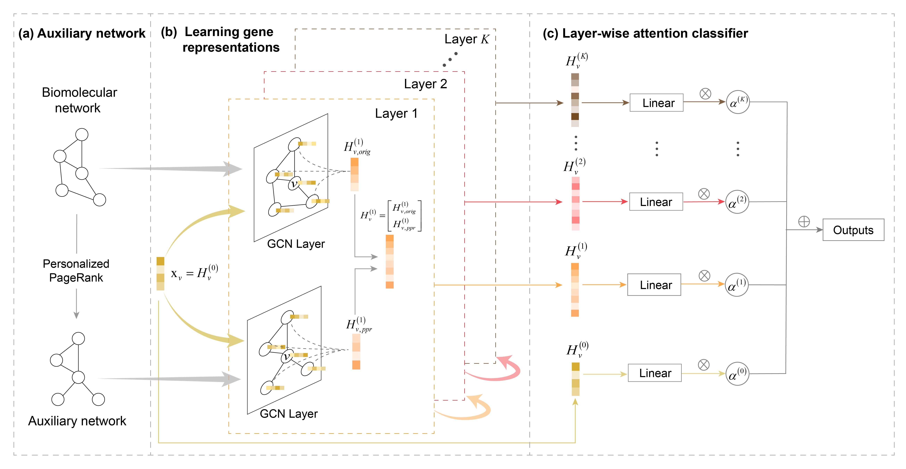

# HGDC: Heterophilic graph diffusion convolutional network for identifying cancer driver genes


[](https://www.gnu.org/licenses/gpl-3.0)

HGDC is a novel machine learning method of heterophilic graph diffusion convolutional networks to boost cancer driver gene identification. HGDC first introduces graph diffusion to generate an auxiliary network for capturing the structurally similar nodes in a biomolecular network. Then, HGDC designs an improved message aggregation and propagation scheme to adapt to the heterophilic setting of biomolecular networks, alleviating the problem of driver gene features being smoothed by its neighboring dissimilar genes. Finally, HGDC uses a layer-wise attention classifier to predict the probability of one gene being a cancer driver gene. The overview of HGDC is shown as follows.




## Requirements
The project is written in Python 3.7 and all experiments were conducted on the Ubuntu server with an Intel Xeon CPU (2.4GHz, 128G RAM) and an Nvidia RTX 3090 GPU (24G GPU RAM). For the faster training process, training on a GPU is necessary, but a standard computer without GPU also works (consuming much more training time). 
We recommend the hardware configuration as follows:

- CPU RAM >= 16G
- GPU RAM >= 8G

All implementations of HGDC and the GNN-based baselines were based on PyTorch and PyTorch Geometric, and SVM method was implemented based on scikit-learn. HGDC requires the following dependencies:

- python == 3.7.11
- numpy == 1.21.2
- pandas == 1.3.3
- scikit-learn == 1.0
- scipy == 1.7.3
- torch == 1.8.0
- torch-geometric == 2.0.2

Dependencies can be installed using the following command:
```
pip install -r requirements.txt
```

## Reproducibility
The scripts of `run_HGDC_5CV.py` and `run_baselines_5CV_test.py` can reproduce the comparison results, which can be done by the following commands, taking the GGNet network as an example:

- HGDC
```
python run_HGDC_5CV.py --graph_diffusion "ppr" --ppr_alpha 0.9 --ppr_eps 0.0001 --net_avg_deg 111 --hk_t 1 --is_5_CV_test True --dataset_file "./data/GGNet/dataset_GGNet_ten_5CV.pkl" --net_file "./data/GGNet/GGNet.txt" --epochs 100 --lr 0.001 --w_decay 0.00001 --in_channels 58 --hidden_channels 100 --device 0
```
- EMOGI
```
python run_baselines_5CV_test.py --graph_diffusion "none" --is_5_CV_test True --dataset_file "./data/GGNet/dataset_GGNet_ten_5CV.pkl" --model "EMOGI" --epochs 5000 --lr 0.01 --device 0
```
- MTGCN
```
python run_baselines_5CV_test.py --graph_diffusion "none" --is_5_CV_test True --dataset_file "./data/GGNet/dataset_GGNet_ten_5CV.pkl" --model "MTGCN" --epochs 1000 --lr 0.01 --device 0
```
- GCN
```
python run_baselines_5CV_test.py --graph_diffusion "none" --is_5_CV_test True --dataset_file "./data/GGNet/dataset_GGNet_ten_5CV.pkl" --model "GCN" --epochs 5000 --lr 0.01 --device 0
```
- GAT
```
python run_baselines_5CV_test.py --graph_diffusion "none" --is_5_CV_test True --dataset_file "./data/GGNet/dataset_GGNet_ten_5CV.pkl" --model "GAT" --epochs 5000 --lr 0.01 --device 0
```
- Chebnet
```
python run_baselines_5CV_test.py --graph_diffusion "none" --is_5_CV_test True --dataset_file "./data/GGNet/dataset_GGNet_ten_5CV.pkl" --model "Chebnet" --epochs 5000 --lr 0.01 --device 0
```
- SVM
```
python run_baselines_5CV_test.py --graph_diffusion "none" --is_5_CV_test True --dataset_file "./data/GGNet/dataset_GGNet_ten_5CV.pkl" --model "SVM" --epochs 5000 --lr 0.01 --device 0
```

The datasets of PathNet and PPNet networks are also provided in the "./data" folder. 

## Usage
The following commands can be used to train HGDC model for n times and generate ranking list of predicted driver genes on a biomolecular network, taking GGNet network as an example:

```
python train_HGDC.py --graph_diffusion "ppr" --ppr_alpha 0.9 --ppr_eps 0.0001 --net_avg_deg 111 --hk_t 1 --dataset_file "./data/GGNet/dataset_GGNet.pkl" --net_file "./data/GGNet/GGNet.txt" --epochs 100 --lr 0.001 --w_decay 0.00001 --in_channels 58 --hidden_channels 100 --device 0 --times 10
```

### Parameters
The detailed descriptions about the arguments are as following:

| Parameter name | Description of parameter |
| --- | --- |
| graph_diffusion | The graph diffusion method. This can be set to `ppr`, `heat`, `simrank` |
| ppr_alpha           | Return probability in personalized PageRank (defaults to 0.9)                      |
| ppr_eps      | Threshold to bound edges at in PPR (defaults to 0.0001)   |
| net_avg_deg      | Average node degree of a network (recommending 111 for GGNet, 24 for PathNet, 50 for PPNet) |
| hk_t       | Times of diffusion in Heat kernel PageRank (defaults to 1)  |
| dataset_file         | The path of the input pkl file             |
| net_file           | The file path of the biomolecular network, corresponding to dataset_file |
| epochs    | Number of epochs to train the model (defaults to 100) |
| lr | Initial learning rate (defaults to 0.001)|
| w_decay | Weight decay (L2 loss on parameters) (defaults to 0.00001)|
| in_channels | Dimension of node features, which is the number of columns of feature matrix. |
| hidden_channels | Dimension of hidden Linear layers (defaults to 100) |
| device | Device id of gpus (defaults to 0)|
| times | Number of times to repeat training HGDC model (defaults to 100)|

### Recommendations
If users use the gene features that we used in our study, we recommend the default hyperparameters for training HGDC on different networks. If users train HGDC on their own feature matrix and network or apply HGDC to other studies, in our opinion, `ppr_alpha`, `lr`, `epochs` and `net_avg_deg` may significantly impact your results. Thus, these hyperparameters should be tuned by searching different combinations of them to generate better predictions. Generally, we tune `ppr_alpha` within a range of [0.3,0.9], `lr` with options of [0.01, 0.001, 0.0001, 0.00001], `epochs` within a range of [50, 3000] (correlating with `lr` value), and `net_avg_deg` is calculated by using the networkx package. In fact, in addition to the personalized PageRank(PPR), we recommend users try other similar methods (e.g., Heat kernel PageRank or SimRank), which have been implemented in our code project. Different graph diffusion methods may also impact the predicted results.

## Transferability


### Using HGDC with trained models
The trained models we used were uploaded in the "./trained_models" folder, consisting of 300 HGDC models trained on GGNet, PathNet and PPNet networks. To facilitate a straightforward use of HGDC on novel driver gene studies, we also provided the final ranking list of predicted driver genes on each network.


### Training HGDC with your own data
Before training HGDC with your own data, you should build a dataset (dictionary) to organize your own data. The script `build_dataset_container.py` can help you build such a dataset which can be directly used for training HGDC. A dataset contains the following data:

* feature: the gene feature matrix
* edge_index: graph edges for training model
* node_name: gene names
* feature_name: feature names
* label: True labels of genes (0 for negative samples and 1 for positive samples),
* k_sets: 5CV splits that randomly generated for ten times
* mask: mask for training a single model without cross-validation

We provided an example in `build_dataset_container.py` to generate a cancer-specific dataset for BLCA cancer. 

Once you built a dataset, you can simply trian HGDC by running command:

```
python train_HGDC.py --graph_diffusion "ppr" --ppr_alpha 0.9 --ppr_eps 0.0001 --net_avg_deg 24 --hk_t 1 --dataset_file "./data/dataset_BLCA_ten_5CV.pkl" --net_file "./data/PathNet/PathNet.txt" --epochs 100 --lr 0.001 --w_decay 0.00001 --in_channels 3 --hidden_channels 100 --device 0 --times 10
```

You can also train your own HGDC with corss-validation by running command:

```
python run_HGDC_5CV.py --graph_diffusion "ppr" --ppr_alpha 0.9 --ppr_eps 0.0001 --net_avg_deg 24 --hk_t 1 --is_5_CV_test True --dataset_file "./data/dataset_BLCA_ten_5CV.pkl" --net_file "./data/PathNet/PathNet.txt" --epochs 100 --lr 0.001 --w_decay 0.00001 --in_channels 3 --hidden_channels 100 --device 0
```

The details of parameters are described above, and some recommendations are also provided, which may help you train HGDC model on your own data.

## Preprocessing your own data
See the [readme file in preprocess_data](preprocess_data/README.md) for explanations on how you can process your own data and prepare it for HGDC training.

> In our study, we follow the data preprocessing steps as described in EMOGI[1], and the data preprocessing code is derived from [EMOGI](https://github.com/schulter/EMOGI). 
> [1]Schulte-Sasse R, Budach S, Hnisz D, et al. Integration of multiomics data with graph convolutional networks to identify new 
cancer genes and their associated molecular mechanisms [J]. Nature Machine Intelligence, 2021, 3(6): 513-26.


## Contact
If you have any questions, feel free to contact Tong Zhang through Email (2672@pdsu.edu.cn) or Github issues. Pull requests are highly welcomed!

